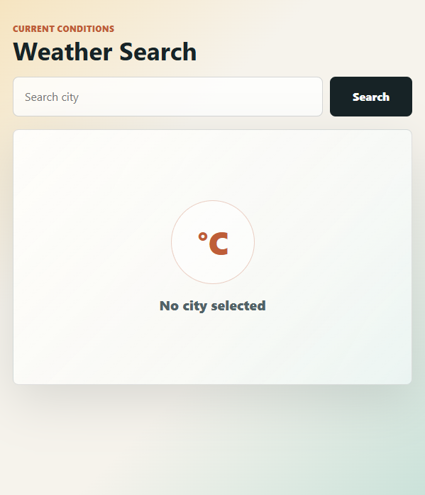

# Weather Search

A small React frontend app that searches for real-time current weather by city name using the OpenWeatherMap API. It is built with Vite, uses React state for request flow, and displays clear idle, loading, error, and success states.

## Screenshot



The screenshot shows the app running locally before a city has been searched.

## Features

- Search current weather by city name.
- Show a loading banner and button spinner while the request is in progress.
- Display friendly error messages for empty input, missing API key, invalid city, network failure, invalid API key, and API limit exceeded.
- Render successful weather results with city, country, temperature, feels-like temperature, humidity, wind speed, pressure, visibility, condition text, and a weather icon.
- Keep the UI responsive across desktop and mobile viewports.

## Tech Stack

- React for UI components and state.
- Vite for development server and production build.
- OpenWeatherMap Current Weather Data API for weather data.
- Plain CSS for layout, styling, responsive behavior, and spinner animation.

## Project Structure

```text
.
|-- assets/
|   `-- weather-app-screenshot.png
|-- src/
|   |-- App.jsx
|   |-- main.jsx
|   `-- styles.css
|-- index.html
|-- package.json
|-- package-lock.json
|-- vite.config.js
`-- README.md
```

## Important Files

| File | Purpose |
| --- | --- |
| `src/main.jsx` | Mounts the React app into the `#root` element and imports global CSS. |
| `src/App.jsx` | Contains the weather search form, API request logic, state handling, error mapping, and result rendering. |
| `src/styles.css` | Styles the app shell, search controls, loading and error banners, weather card, idle state, and responsive layout. |
| `index.html` | Provides the Vite HTML entry point. |
| `package.json` | Defines dependencies and scripts for development, build, and preview. |
| `vite.config.js` | Configures Vite with the React plugin. |

## App Flow

1. The user enters a city name in the search box.
2. `handleSubmit` prevents the default form submit.
3. The city value is trimmed and validated.
4. The app checks for `VITE_OPENWEATHER_API_KEY`.
5. A URL is created for the OpenWeatherMap current weather endpoint.
6. `status` is set to `loading`.
7. `fetch` requests current weather data.
8. If the response is successful, the API response is mapped into a smaller UI-friendly object.
9. If the response fails, the HTTP status or network failure is mapped to a readable error message.
10. The UI updates based on `status` and `weather`.

## Weather API

The app uses:

```text
https://api.openweathermap.org/data/2.5/weather
```

Query parameters:

| Parameter | Value | Purpose |
| --- | --- | --- |
| `q` | User-entered city | Searches weather by city name. |
| `appid` | `VITE_OPENWEATHER_API_KEY` | Authenticates the OpenWeatherMap request. |
| `units` | `metric` | Returns temperature in Celsius. |

## UI States

| State | Trigger | What the user sees |
| --- | --- | --- |
| `idle` | App first loads | Search form and a "No city selected" panel. |
| `loading` | Valid search begins | Disabled search button, button spinner, and loading banner. |
| `error` | Validation, API, or network problem | Error banner with a specific message. |
| `success` | API returns valid weather data | Weather card with current weather details. |

## Error Handling

| Case | How it is detected | Message shown |
| --- | --- | --- |
| Empty city | City input is blank after trimming | `Enter a city name to search.` |
| Missing API key | `VITE_OPENWEATHER_API_KEY` is unavailable | `Missing OpenWeatherMap API key...` |
| Invalid city | API returns `404` | `City not found. Check the spelling and try another search.` |
| API limit exceeded | API returns `429` | `API limit exceeded. Wait a little while before searching again.` |
| Invalid API key | API returns `401` | `OpenWeatherMap rejected the API key...` |
| Network failure | `fetch` throws a `TypeError` | `Network failure. Check your connection and try again.` |
| Other API issue | Any other failed response | API message or a generic fallback error. |

## Setup

Install dependencies:

```bash
npm install
```

On Windows PowerShell, use this if script execution policy blocks `npm`:

```bash
npm.cmd install
```

Create a local environment file:

```bash
.env.local
```

Add your OpenWeatherMap API key:

```bash
VITE_OPENWEATHER_API_KEY=your_openweathermap_api_key_here
```

Start the dev server:

```bash
npm run dev
```

On Windows PowerShell:

```bash
npm.cmd run dev
```

If port `5173` is already busy, run:

```bash
npm.cmd run dev -- --port 5174 --strictPort
```

Then open the local URL printed by Vite.

## Scripts

| Command | Description |
| --- | --- |
| `npm run dev` | Starts the Vite development server. |
| `npm run build` | Creates a production build in `dist/`. |
| `npm run preview` | Serves the production build locally for preview. |

## Notes

- This is a frontend-only app, so the OpenWeatherMap API key is exposed to the browser at runtime. For a production app, proxy weather requests through a backend if the key must stay private.
- A valid OpenWeatherMap API key is required before real weather searches can succeed.
- The screenshot in this README was captured from the local Vite dev server.
